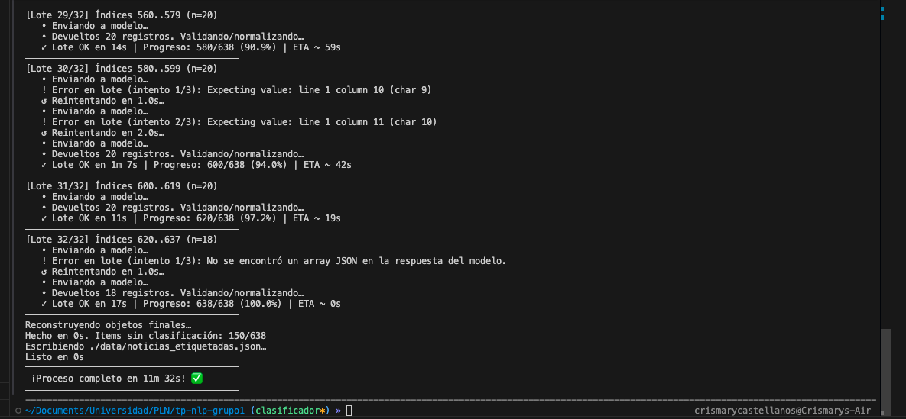

# Clasificador de noticias (TP PLN - Grupo 1)

Repositorio para la tarea de la asignatura: scrapear páginas de noticias, clasificarlas por ministerio usando un LLM (OpenRouter / Minimax M2) y producir resúmenes por ministerio.

Ministerios: 
- Salud 
- Educacion 
- Seguridad 
- Trabajo
- Economia

---
### Estructura del proyecto
```
..
├── clasificador/                  # Módulo principal del clasificador
│   ├── __init__.py
│   ├── config.py                  # Configuración: rutas/constantes (INPUT_FILE, OUTPUT_FILE, LOTE, etc.)
│   ├── openrouter_client.py       # Cliente y helpers para invocar el modelo vía API
│   ├── pipeline_classificador.py  # Punto de entrada del pipeline por lotes
│   ├── prompts.py                 # Prompts del sistema/usuario
│   ├── schema.py                  # Modelos Pydantic (ej: ClasifOut) y validaciones
│   ├── data/                      # Dataset de entrada/salida
│   │   ├── noticias.json              # Noticias sin clasificar (input)
│   │   └── noticias_etiquetadas.json  # Noticias clasificadas (output)
│   └── utils/                     # Funciones de utilidad compartidas
│       ├── __init__.py
│       └── time_utils.py              # Helpers de tiempo (ej: format_duration_hms)
├── .gitignore                    # Exclusiones para control de versiones
├── newsScraper.py                 # Script de scraping para generar noticias.json
├── package-lock.json              # Lockfile de NPM (si se usan herramientas Node en scraping)
├── README.md                      # Documentación del proyecto
├── requirements.txt               # Dependencias de Python


```
---

### Scraper

---

### Clasificador
- Lee un JSON de entrada con artículos (configurable).
- Envía los artículos en lotes al modelo para clasificar el ministerio correspondiente.
- Normaliza y valida la respuesta (esquema pydantic) y guarda un JSON de salida con la clasificación.

Estructura
- clasificador/
  - pipeline_classificador.py  — orquestador principal (run_pipeline)
  - openrouter_client.py      — cliente HTTP para OpenRouter
  - config.py                 — constantes/paths y parámetros (INPUT_FILE, OUTPUT_FILE, LOTE, TEMPERATURE, TOP_P…)
  - schema.py                 — modelos pydantic para validar la salida
  - prompts.py                — prompts para el modelo

Ejemplo de ejecución finalizada con exito

---
### Requisitos
- Python 3.9+
- requests, pydantic (instalar desde requirements.txt si existe)
Comandos (macOS / Linux):
- Crear y activar entorno:
  - python3 -m venv .venv
  - source .venv/bin/activate
- Instalar dependencias:
  - pip install -r requirements.txt
  - o (mínimo): pip install requests pydantic

### Variables de entorno importantes
- OPENROUTER_API_KEY — API key para OpenRouter (obligatoria)
- OPENROUTER_API_URL — URL de la API (por defecto: https://openrouter.ai/api/v1/chat/completions)
- OPENROUTER_MODEL — modelo a usar (por defecto: minimax/minimax-m2:free)
- OPENROUTER_TIMEOUT — timeout en segundos (opcional)

Ejemplo (macOS zsh / bash)
```bash
export OPENROUTER_API_KEY="sk-...tu_key..."
export OPENROUTER_MODEL="minimax/minimax-m2:free"
# opcional: export OPENROUTER_TIMEOUT="120"

# ejecutar (desde la raíz del repo)
python3 -m clasificador.pipeline_classificador
# ó
python3 clasificador/pipeline_classificador.py
```

Nota: En caso de no configurar las variables de entorno hacerlo en el archivo `config.py`

---
### Salida
- Se escribe OUTPUT_FILE en formato JSON con los artículos y el campo `ministerio` (lista de strings).

### Depuración rápida de errores comunes
- "Invalid input: expected number, received string": revisar TEMPERATURE / TOP_P en clasificador/config.py o en variables de entorno. Asegurarse de convertirlas a float antes de enviarlas al API.
- Errores HTTP 4xx/5xx: revisar la API key y el formato del payload (ver openrouter_client.py).
